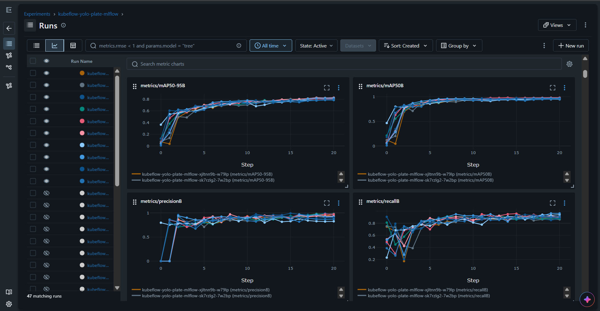

# License plate recognition with `Kubeflow`

An `Kubeflow` project that trains and deploys an object detection model (`YOLO`) through a full `MLOps` workflow — from labelled images to an inference endpoint behind a public web app.

      

- [License plate recognition with `Kubeflow`](#license-plate-recognition-with-kubeflow)
  - [Business Challenge](#business-challenge)
  - [Architecture](#architecture)
  - [Model training with `Kubeflow`](#model-training-with-kubeflow)
    - [MLOps Pipeline](#mlops-pipeline)
    - [`Jupyter notebook` \& `MLflow`](#jupyter-notebook--mlflow)
    - [Train with `gpu` node and `karpenter`](#train-with-gpu-node-and-karpenter)
  - [Inference deployment](#inference-deployment)
  - [Road Map - Further features](#road-map---further-features)
  - [Documentation](#documentation)

---

## Business Challenge

Computer vision models like `YOLO` are popular for object detection in manufacturing.

> However, integrating these computer vision models reliably into business applications remains a significant challenge.

This project demonstrates an end-to-end MLOps workflow by **training**, **deploying**, and **serving** a `YOLO` model that **detects vehicle license plates**.


> OCR feature is not included — the model detects plate regions, it does not read them.

---

## Architecture

- Infrastructure diagram


- Cluster diagram


- Repo layout

```
kubeflow-yolo/

```

---

## Model training with `Kubeflow`

Train the `YOLO` model with `Kubeflow notebook`.

### MLOps Pipeline

1. **Data collection** — collect images of license plates.
2. **Feature engineering** — label images.
3. **Model training and experiment tracking** — run training code with a `SageMaker pipeline` and log metrics to `MLflow`.
4. **Evaluate model** — register the model only when `mAP50-95` clears the `0.70` gate.
5. **Package and deploy** — serve the model from a `SageMaker` serverless endpoint.
6. **Integrate** the **inference endpoint** with the **web application**.

- SageMaker pipeline to automate training


---

### `Jupyter notebook` & `MLflow`

- `Jupyter notebook`: train the `YOLO` model


- `MLflow`: track training metrics



- `MLflow`: hyperparameter sweep for the best performance


---

### Train with `gpu` node and `karpenter`

---

## Inference deployment

1. **Promote the model** — approve a version in the `sagemaker-yolo` model package group.
2. **Serve** the approved model from a `SageMaker` serverless endpoint, so idle time costs nothing.
3. **Integrate** the endpoint with the web application through the `Lambda` proxy behind `CloudFront`.
4. **Monitor** application performance metrics with `Cloudwatch Dashboard` and costs with `AWS Budgets`.

- **Performance metrics**


- **CI/CD pipeline**


- **Budgets**


---

## Road Map - Further features

| Feature                  | Goal                                                            | Approach                                                                                                |
| ------------------------ | --------------------------------------------------------------- | ------------------------------------------------------------------------------------------------------- |
| **Plate OCR**            | Read the plate text, not just locate the plate.                 | Crop the detected box and run a text recognition model as a second stage.                               |
| **Automated retraining** | Keep the model fresh without manual runs.                       | Trigger the `SageMaker pipeline` when new labelled data lands in `S3`; watch for drift on the endpoint. |
| **Video & batch input**  | Process a video or a folder of images, not one image at a time. | Add an `S3`-upload-triggered batch path alongside the existing real-time endpoint.                      |

---

## Documentation

- [IaC with `Terraform`](./docs/01_infra.md)
- [Kubeflow Installation](./docs/02_kubeflow_install.md)
- [Jupyter notebook](./docs/03_kubeflow_notebook.md)
- [Experiment with `Katib`](./docs/04_kubeflow_katib.md)
- [Kubeflow Pipeline](./docs/05_kubeflow_pipeline.md)
- [Deploy with `KServe`](./docs/06_kubeflow_kserve.md)

---
