# GPU-Enabled MLOps Platform on `AWS EKS` with `kubeflow`

> One platform. 3 engineerings. End-to-end MLOps practice.

An end-to-end **MLOps platform** that trains, tracks, deploys, and serves a YOLO object detection model on `AWS EKS` using `Kubeflow`, `MLflow`, `KServe`, `Terraform`, `Argo CD`, and `GitHub Actions`.

         

         

      

- [GPU-Enabled MLOps Platform on `AWS EKS` with `kubeflow`](#gpu-enabled-mlops-platform-on-aws-eks-with-kubeflow)
  - [Business Challenge](#business-challenge)
  - [Architecture](#architecture)
  - [ML Engineering](#ml-engineering)
    - [ML Engineering in Action](#ml-engineering-in-action)
  - [Platform Engineering](#platform-engineering)
    - [Infrastructure as Code](#infrastructure-as-code)
    - [Platform Capabilities](#platform-capabilities)
    - [Platform engineering in Action](#platform-engineering-in-action)
  - [DevOps Engineering](#devops-engineering)
    - [CI/CD Pipelines with `GitHub Actions`](#cicd-pipelines-with-github-actions)
    - [GitOps with `Argo CD`](#gitops-with-argo-cd)
  - [Roadmap](#roadmap)
  - [Documentation](#documentation)

---

## Business Challenge

**Machine learning models** can deliver strong business value, but moving them from **experimentation** to reliable **production** use requires more than model training.

> THow do teams close the **GAP** between <u>experimentation</u> and <u>production</u>?

This project addresses that challenge building an end-to-end MLOps platform for a YOLO object detection model with **3 engineering perspectives**:

1. `ML Engineering`: experiment, train, track, store, and serve the model.
2. `Platform Engineering`: provide scalable `GPU` compute, storage, networking, security, and observability on `EKS`.
3. `DevOps Engineering`: automate infrastructure and application delivery with `Terraform`, `GitHub Actions`, `Argo CD`, and `GitOps`.

---

- **Live application demo**: car plate detection

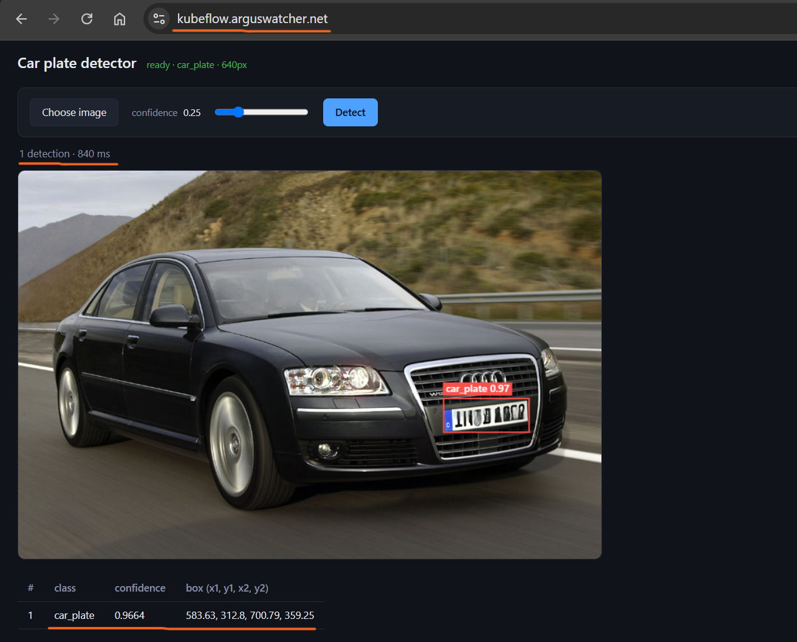

---

## Architecture

- Architecture Diagram

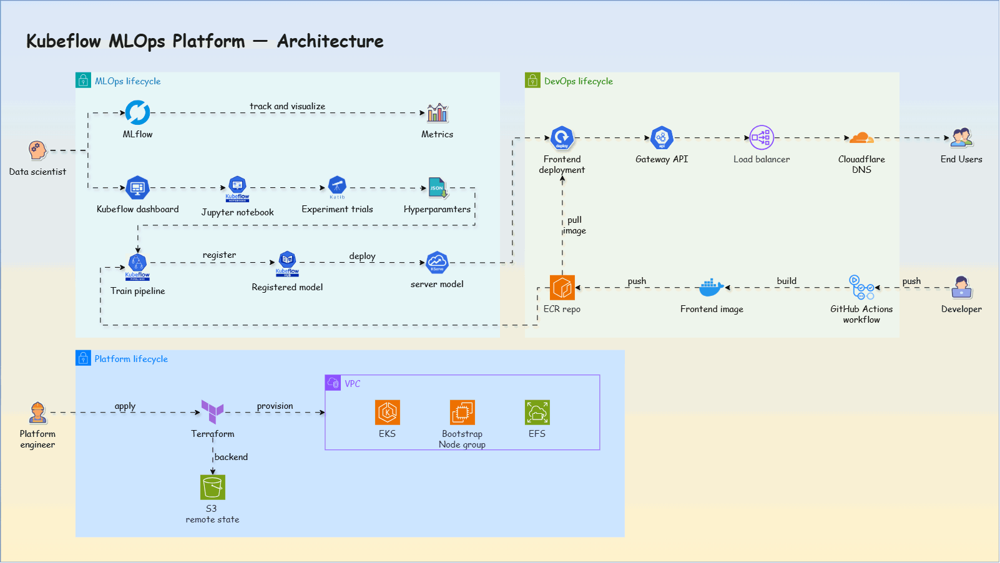

- Repository Layout

```text
kubeflow-yolo/
├── .github/
│   └── workflows/          # CI/CD workflows
├── data/                   # Dataset files and related assets
├── argocd/                 # Argo CD applications and platform components
├── app-of-apps.yaml        # Argo CD root application
├── infra/                  # Terraform modules and AWS infrastructure
├── jupyter-notebook/       # Model development and experimentation notebooks
├── kubeflow/               # Kubeflow pipelines and related configurations
├── train-job/              # YOLO training code and training image
├── inference/              # KServe inference application and image
├── frontend/               # Web UI and Nginx image
├── docs/                   # Detailed implementation documentation
└── README.md               # Project overview and documentation index
```

---

## ML Engineering

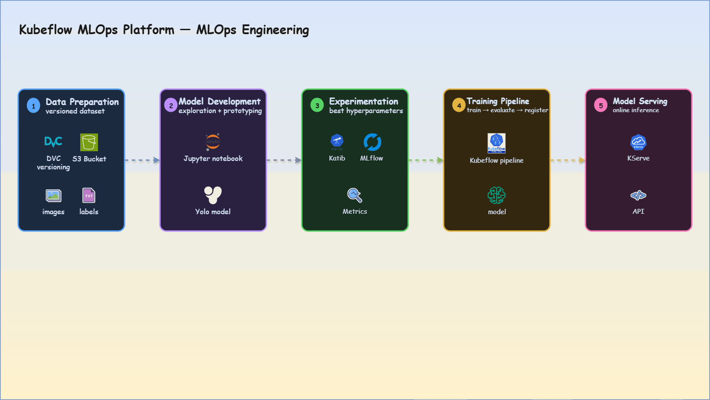

| #   | ML Stage          | Components / Technologies                                                                                      |
| --- | ----------------- | -------------------------------------------------------------------------------------------------------------- |
| 1   | Data preparation  | Images and labels stored in `S3`; versioned with `DVC`                                                         |
| 2   | Model development | `Jupyter Notebook`                                                                                             |
| 3   | Experimentation   | `Katib` for hyperparameter trials; `MLflow` for metrics and run tracking                                       |
| 4   | Training pipeline | `Kubeflow Pipeline` for orchestration; artifacts stored in `S3`; model registered and versioned after training |
| 5   | Model serving     | `KServe` for online inference                                                                                  |

---

### ML Engineering in Action

- **Data**: images and labels
  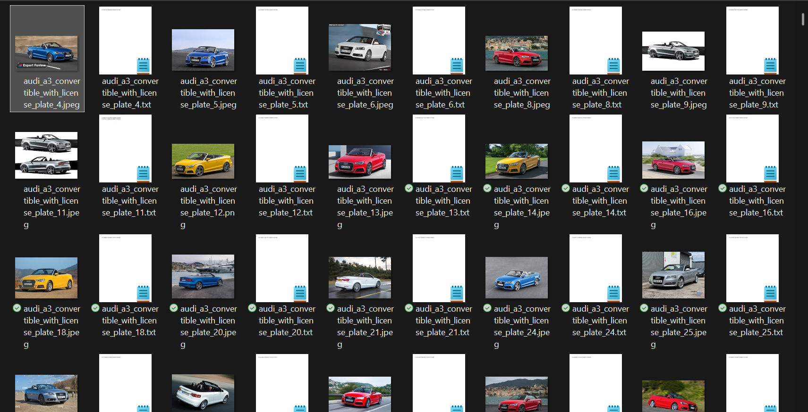

- **Development**: model exploration in `Jupyter`
  

- **Experiments**: `Katib` runs trials
  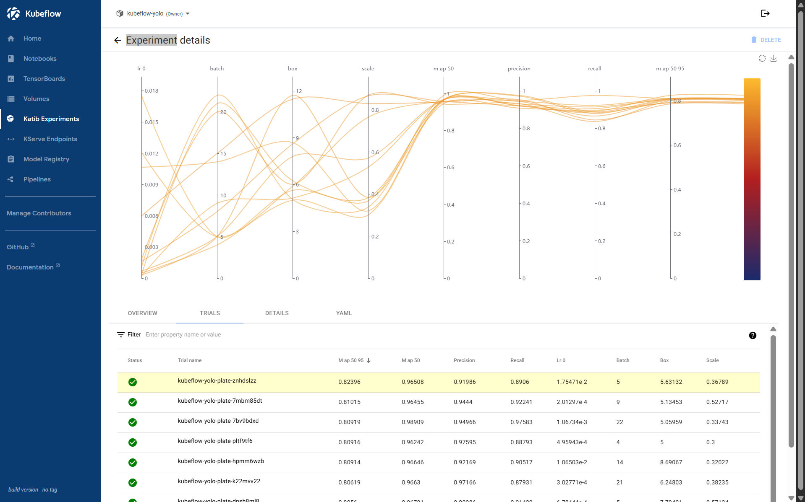

- **Experiments**: `MLflow` tracks metrics
  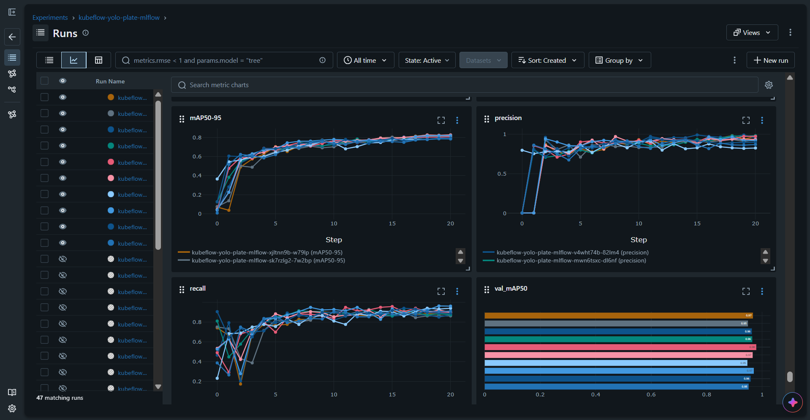

- **Pipeline**: `Kubeflow Pipeline` trains, evaluates, and registers
  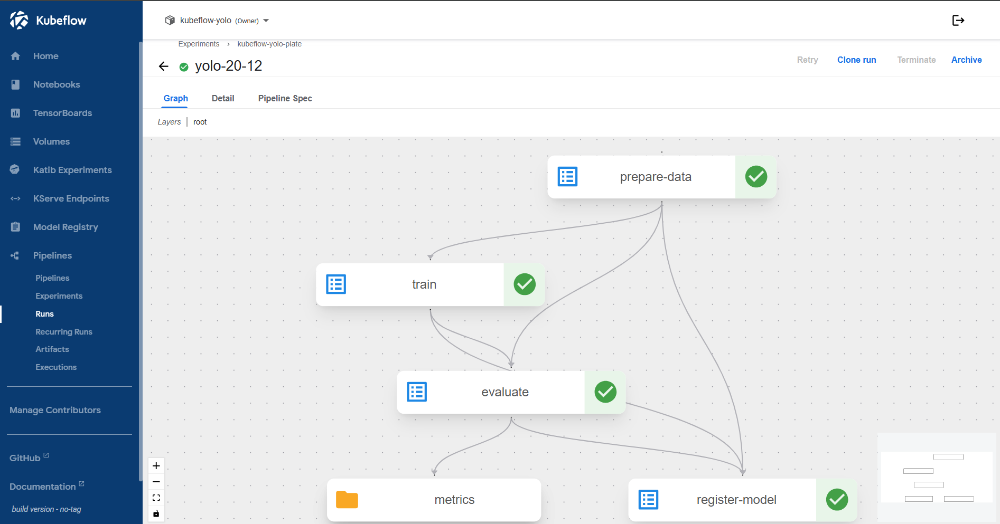

- **Serving**: deploy the selected model with `KServe`
  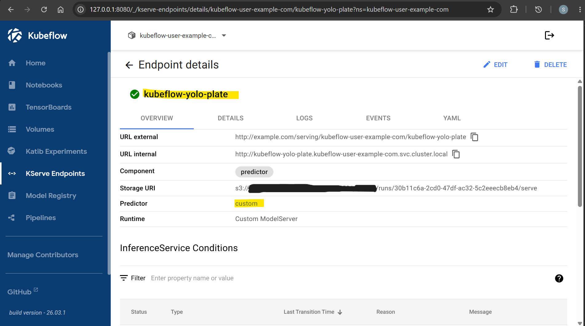

---

## Platform Engineering

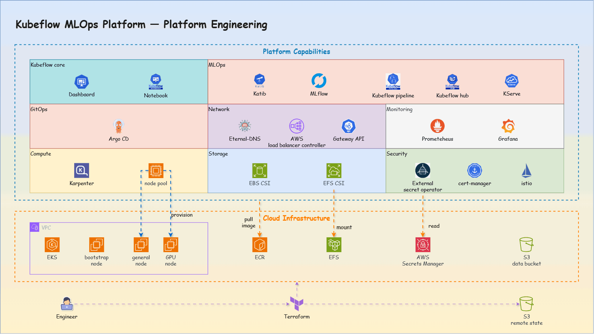

### Infrastructure as Code

AWS infrastructure is managed with **Terraform**:

- using an **`S3` remote backend**
- integrating `GitHub Actions` for `fmt`, `validate`, `plan`, and `apply`.

---

### Platform Capabilities

| Capability | Infrastructure / Cluster                                     | Purpose                                          |
| ---------- | ------------------------------------------------------------ | ------------------------------------------------ |
| Compute    | EKS, Karpenter, node selectors                               | Autoscaling and GPU node provisioning            |
| Storage    | S3, EBS, EFS, StorageClass, PVC                              | Persistent and shared storage for ML workloads   |
| Networking | VPC, ALBC, Istio, Gateway API, ExternalDNS                   | North-south/east-west traffic and automated DNS  |
| Security   | Secrets Manager, KMS, ESO, cert-manager, NetworkPolicy, mTLS | Secrets, encryption, certificates, and isolation |
| Monitoring | Prometheus, Grafana                                          | Logs and platform metrics                        |

---

### Platform engineering in Action

- EKS cluster

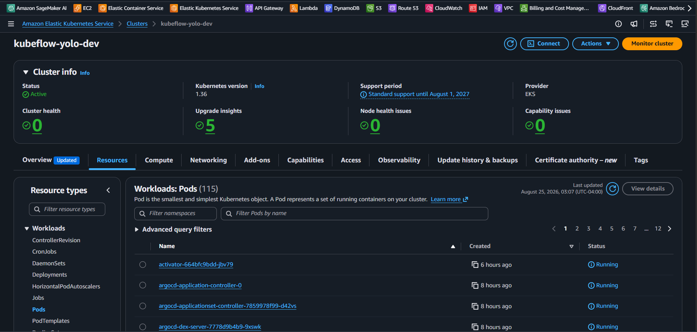

- Self-managed nodes `GPU` nodes via `Karpenter`

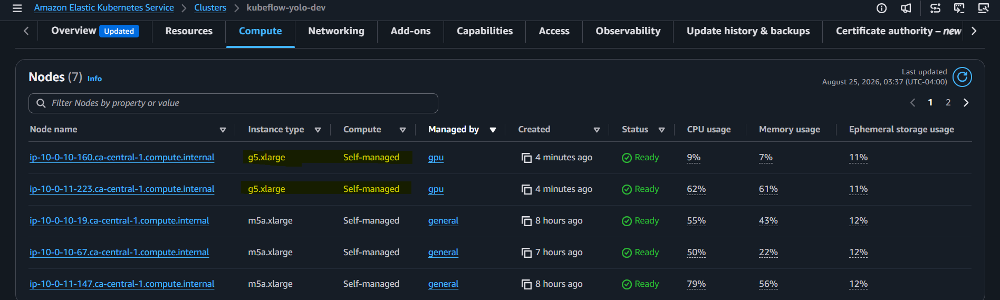

- Grafana dashboard - GPU

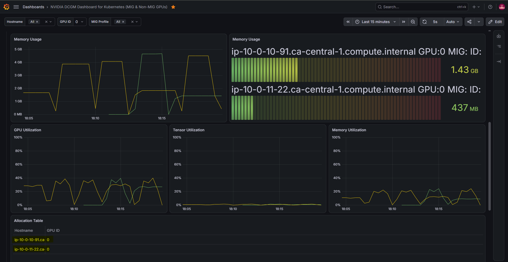

- Grafana dashboard - Cluster

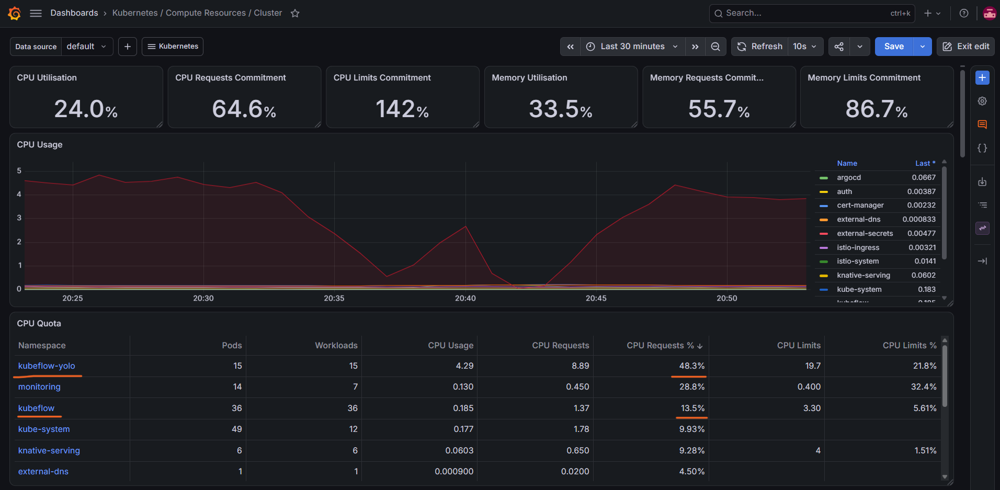

---

## DevOps Engineering

### CI/CD Pipelines with `GitHub Actions`

| Pipeline                | Key Steps                                   | Purpose                                |
| ----------------------- | ------------------------------------------- | -------------------------------------- |
| `terraform-apply`       | Trigger, `fmt`, `validate`, `plan`, `apply` | Deploy infrastructure with `Terraform` |
| `build-image-train`     | Trigger, build, push                        | Publish **training** image to `ECR`    |
| `build-image-inference` | Trigger, build, push                        | Publish **inference** image to `ECR`   |
| `build-image-frontend`  | Trigger, build, push                        | Publish **frontend** image to `ECR`    |

- CI/CD pipeline in action

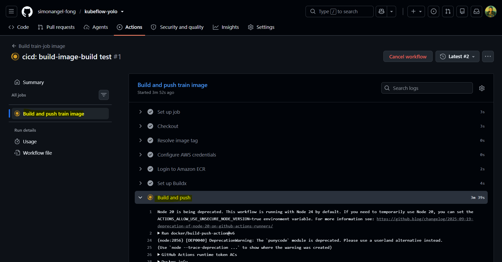

---

### GitOps with `Argo CD`

Use GitOps practices to manage deployment via `Argo CD`:

- **App-of-Apps**: declaratively manages platform and application components.
- **`Git` as source of truth**: `Argo CD` continuously reconciles the cluster with the repository.
- **Automated deployment**: platform and application changes are applied through `GitOps`.

- `Argo CD` in action

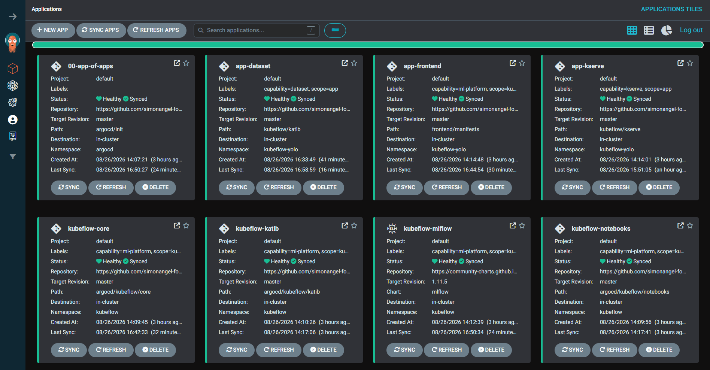

---

## Roadmap

| Stage                      | Focus                                                                                      |
| -------------------------- | ------------------------------------------------------------------------------------------ |
| **Make it work — current** | Deliver a MVP functional end-to-end MLOps platform                                         |
| **Make it right**          | Add model promotion gates, policy as code, latency monitoring, and CI/CD security scanning |
| **Make it fast**           | Optimize container builds with multi-stage build and enable pipeline caching               |
| **Make it efficient**      | Add FinOps practices and deeper Prometheus/Grafana monitoring                              |

---

## Documentation

Detailed implementation guides:

- [Infrastructure with `Terraform`](./docs/01_infra.md)
- [`Kubeflow` Installation](./docs/02_kubeflow_install.md)
- [Model Development in `Jupyter`](./docs/03_kubeflow_notebook.md)
- [Hyperparameter Experiments with `Katib`](./docs/04_kubeflow_katib.md)
- [Training with `Kubeflow Pipelines`](./docs/05_kubeflow_pipeline.md)
- [Model Serving with `KServe`](./docs/06_kubeflow_kserve.md)
- [Frontend Deployment](./docs/07_app_frontend.md)
- [CI/CD pipelines](./docs/08_cicd.md)
- [Monitoring](./docs/09_monitoring.md)

---

- detail docs
