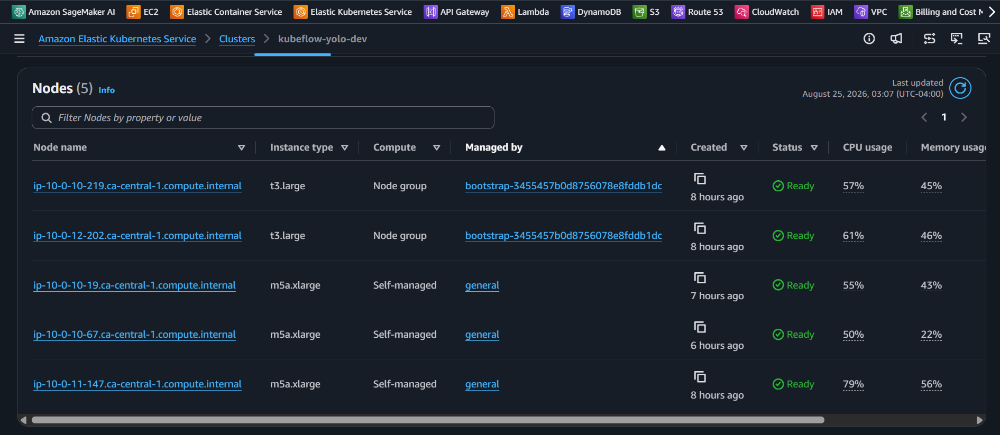
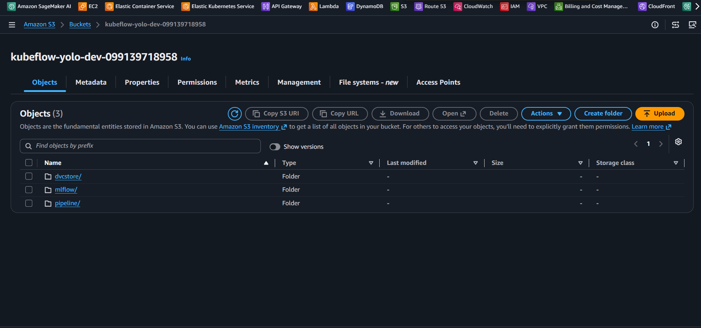
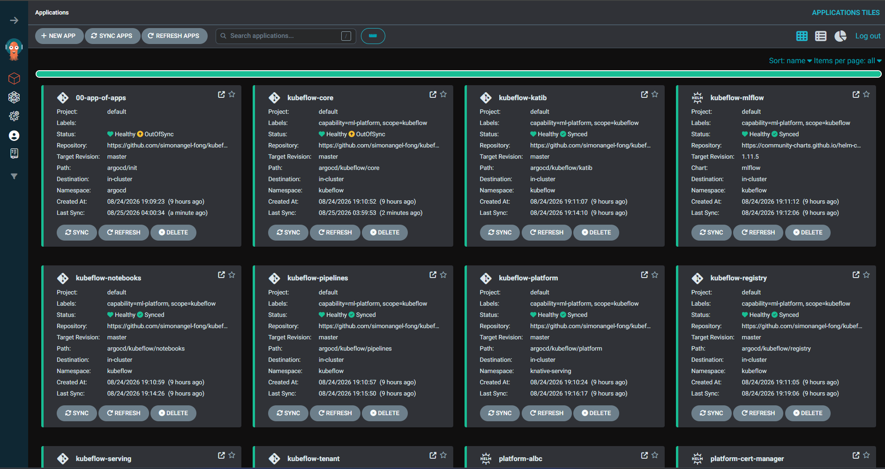

# Kubeflow: Infrastructrure

[Back](../README.md)

- [Kubeflow: Infrastructrure](#kubeflow-infrastructrure)
  - [IaC - Terraform](#iac---terraform)
  - [ArgoCD](#argocd)
  - [Runbook](#runbook)

---

## IaC - Terraform

```sh
terraform -chdir=infra init -backend-config=backend.hcl

terraform -chdir=infra fmt && terraform -chdir=infra validate
terraform -chdir=infra apply -auto-approve

terraform -chdir=infra refresh
terraform -chdir=infra output

terraform -chdir=infra import

terraform -chdir=infra destroy -auto-approve
```

- EKS cluster


- EKS node group



- S3 bucket



---

## ArgoCD

```sh
aws eks update-kubeconfig --region ca-central-1 --name kubeflow-yolo-dev
kubectl -n argocd get secret argocd-initial-admin-secret -o jsonpath="{.data.password}" | base64 -d
kubectl -n argocd port-forward svc/argocd-server 8000:443

kubectl apply -f app-of-apps.yaml
# application.argoproj.io/00-app-of-apps created

argocd login localhost:8000
```



---

## Runbook

```sh
# finalizer issue
kubectl -n argocd patch app/platform-karpenter --type merge -p '{"metadata":{"finalizers":[]}}'

# restart
kubectl -n external-secrets rollout restart deploy external-secrets
kubectl -n kube-system rollout restart deploy aws-load-balancer-controller

# hard refresh
kubectl patch applications.argoproj.io 00-app-of-apps -n argocd --type merge -p '{"metadata":{"annotations":{"argocd.argoproj.io/refresh":"hard"}}}' 2>&1; sleep 20; kubectl get applications.argoproj.io -n argocd 2>&1

# remove secret
aws secretsmanager delete-secret --secret-id kubeflow-yolo-dev/mlflow-flask-key --force-delete-without-recovery

```

- import

```hcl
import {
  to       = aws_secretsmanager_secret.mlflow_postgres
  identity = { "arn" = "<secret_arn>" }
}
```
