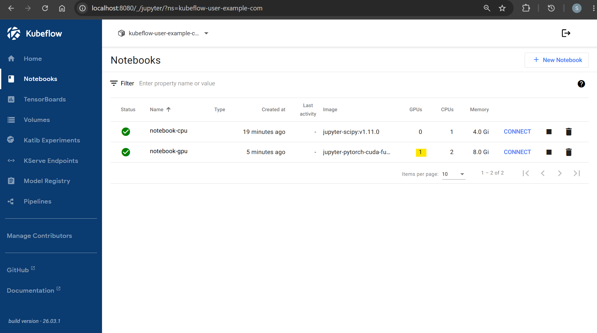
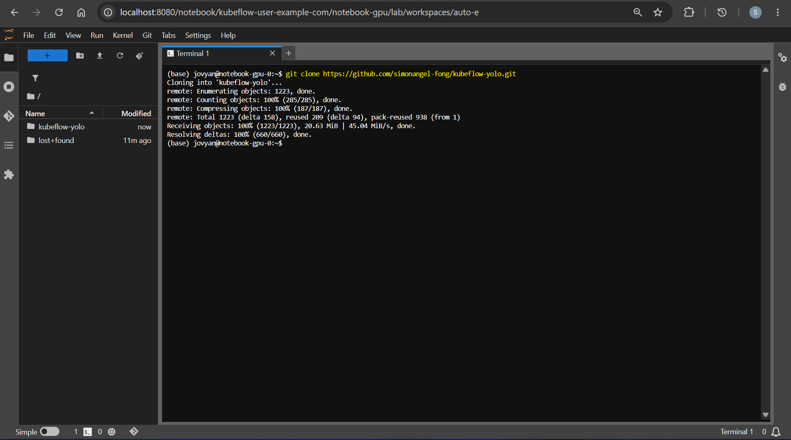
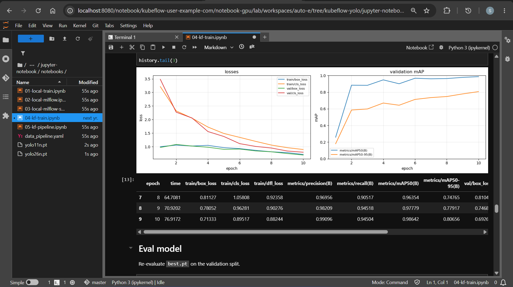
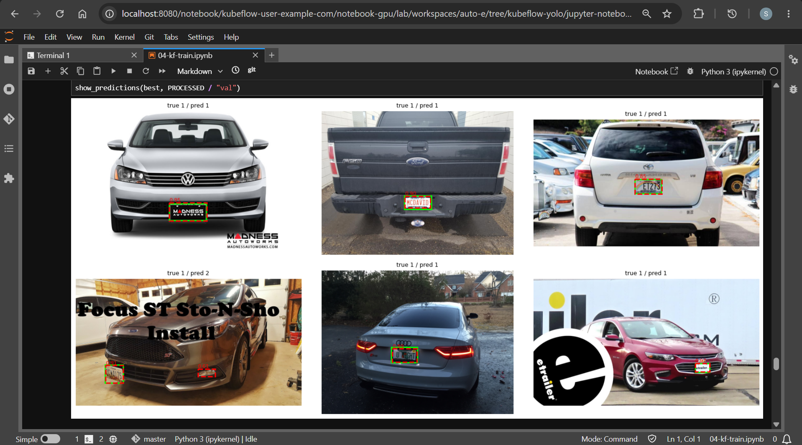

# Kubeflow: Jupyter notebook

[Back](../README.md)

---

## Notebook

```sh
# provision notebook instance
kubectl apply -f kubeflow/pipelines/kfp-api-token.yaml
# poddefault.kubeflow.org/kfp-api-token created

kubectl apply -f kubeflow/notebook/notebook-cpu.yaml
# persistentvolumeclaim/notebook-cpu-pvc created
# notebook.kubeflow.org/notebook-cpu created

kubectl apply -f kubeflow/notebook/notebook-gpu.yaml
# persistentvolumeclaim/notebook-gpu-pvc created
# notebook.kubeflow.org/notebook-gpu created

kubectl get notebook,pod,pvc -n kubeflow-yolo
# NAME                                 AGE
# notebook.kubeflow.org/notebook-cpu   22m
# notebook.kubeflow.org/notebook-gpu   7m17s

# NAME                                             READY   STATUS    RESTARTS   AGE
# pod/model-registry-db-86979795c4-6f9zp           1/1     Running   0          33m
# pod/model-registry-deployment-64686c8cbf-qkkr6   2/2     Running   0          33m
# pod/model-registry-ui-6cc794669b-lnhjg           2/2     Running   0          33m
# pod/notebook-cpu-0                               2/2     Running   0          22m
# pod/notebook-gpu-0                               2/2     Running   0          7m17s

# NAME                                      STATUS   VOLUME                                     CAPACITY   ACCESS MODES   STORAGECLASS   VOLUMEATTRIBUTESCLASS   AGE
# persistentvolumeclaim/metadata-postgres   Bound    pvc-f09e845c-00e5-4806-b179-095c485fe17f   10Gi       RWO            gp3            <unset>                 33m
# persistentvolumeclaim/notebook-cpu-pvc    Bound    pvc-cbfe499c-5ea8-4430-bb85-20423e70b5c6   20Gi       RWO            gp3            <unset>                 22m
# persistentvolumeclaim/notebook-gpu-pvc    Bound    pvc-0555c691-692f-4015-9430-dd7cf3644592   50Gi       RWO            gp3            <unset>                 7m18s

# confirm
kubectl get pod notebook-cpu-0 notebook-gpu-0 -n kubeflow-yolo -o wide
# NAME             READY   STATUS    RESTARTS   AGE     IP            NODE                                           NOMINATED NODE   READINESS GATES
# notebook-cpu-0   2/2     Running   0          23m     10.0.11.66    ip-10-0-11-26.ca-central-1.compute.internal    <none>           <none>
# notebook-gpu-0   2/2     Running   0          8m19s   10.0.11.251   ip-10-0-11-115.ca-central-1.compute.internal   <none>           <none>
```



---

### Download notebook

```sh
# clone project
git clone https://github.com/simonangel-fong/kubeflow-yolo.git
```



---

## Train model

---

### Track data

```sh
# install dvc in venv
pip install -r requirements.txt

dvc version
# DVC version: 3.67.1 (pip)

# Initialize
dvc init
# Initialized DVC repository.

# You can now commit the changes to git.

# +---------------------------------------------------------------------+
# |                                                                     |
# |        DVC has enabled anonymous aggregate usage analytics.         |
# |     Read the analytics documentation (and how to opt-out) here:     |
# |             <https://dvc.org/doc/user-guide/analytics>              |
# |                                                                     |
# +---------------------------------------------------------------------+

# What's next?
# ------------
# - Check out the documentation: <https://dvc.org/doc>
# - Get help and share ideas: <https://dvc.org/chat>
# - Star us on GitHub: <https://github.com/treeverse/dvc>

# get bucket id
terraform -chdir=infra output -raw s3_bucket_name
# kubeflow-yolo-dev-099139718958

# Set S3 as Remote Storage
dvc remote add -d s3 s3://kubeflow-yolo-dev-099139718958/data/raw
# Setting 's3' as a default remote.

# track data
dvc add data/raw
# 100% Adding...|███████████████████████████████████████████████████████████████████████████████████████████|1/1 [00:00,  2.37file/s]

# To track the changes with git, run:

#         git add 'data\raw.dvc'

# To enable auto staging, run:

#         dvc config core.autostage true

git add .gitignore data/raw.dvc .dvc/config
git commit -m "dvc: track data/raw"
dvc push
# Collecting                                                                                                   |1.11k [00:01,  985entry/s]
# Pushing
# 1096 files pushed

```

---

### Training




