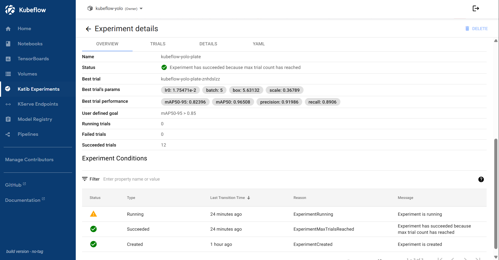
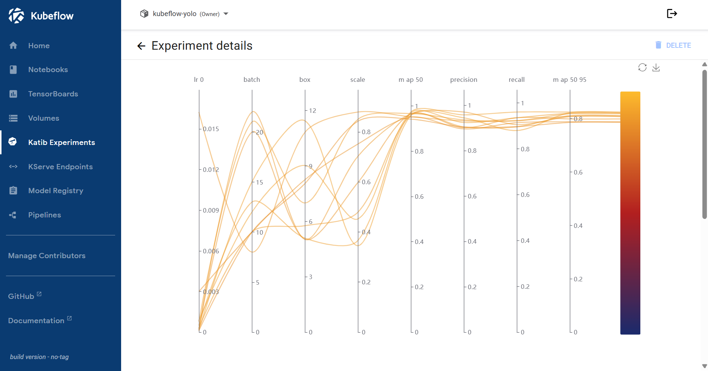
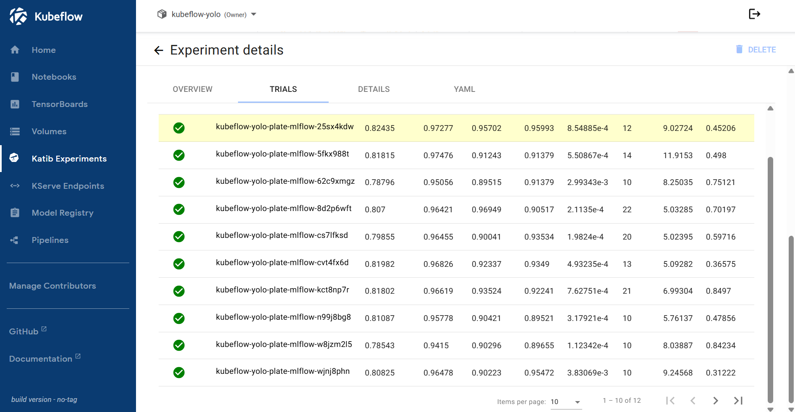
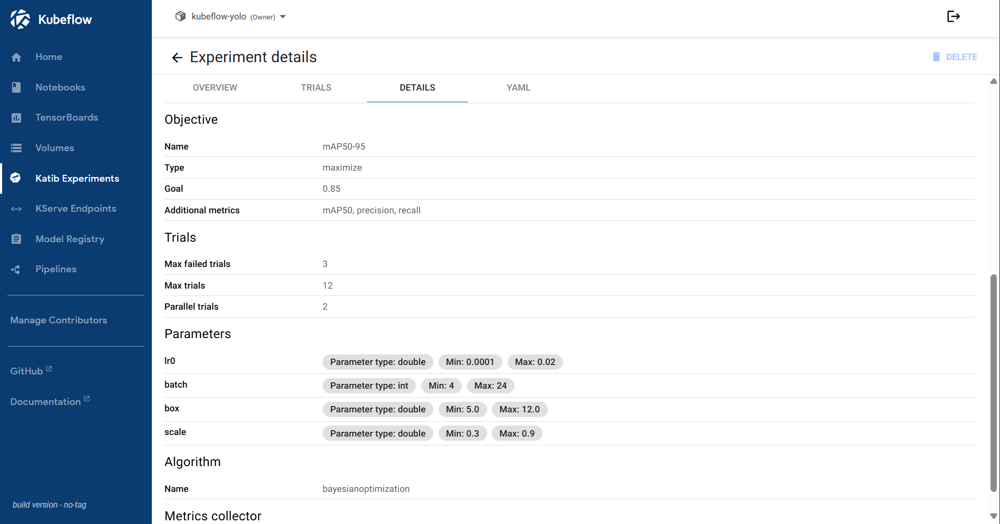
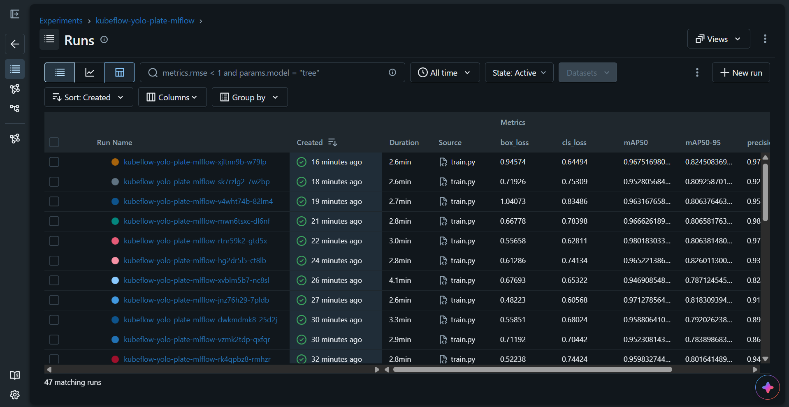
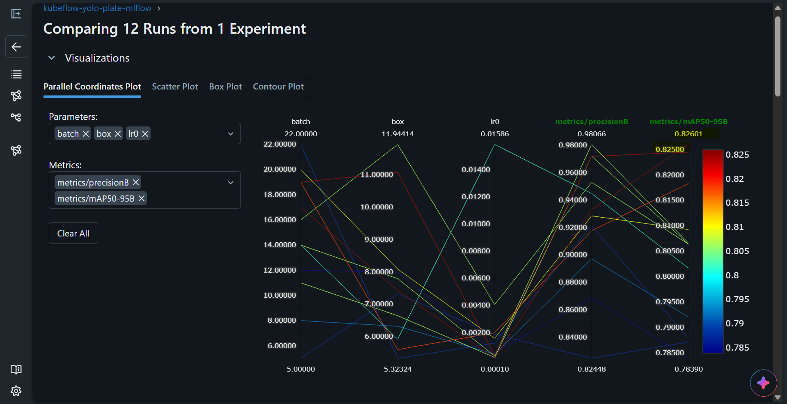
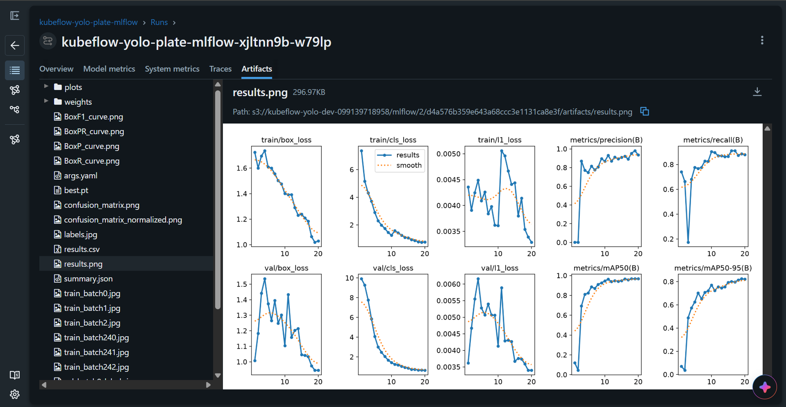
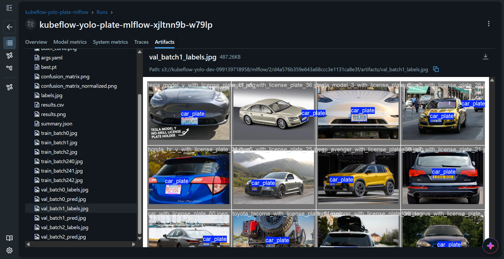

# Kubeflow: Katib

[Back](../README.md)

- [Kubeflow: Katib](#kubeflow-katib)
  - [Katib](#katib)
    - [Build and push to ECR](#build-and-push-to-ecr)
    - [Run the experiment](#run-the-experiment)
  - [MLflow tracking](#mlflow-tracking)
  - [Runbook](#runbook)

---

## Katib

### Build and push to ECR

```sh
terraform -chdir=infra/project output
# ecr_repository_urls = {
#   "frontend" = "099139718958.dkr.ecr.ca-central-1.amazonaws.com/kubeflow-yolo-frontend"
#   "kserve" = "099139718958.dkr.ecr.ca-central-1.amazonaws.com/kubeflow-yolo-kserve"
#   "train" = "099139718958.dkr.ecr.ca-central-1.amazonaws.com/kubeflow-yolo-train"
# }

# login
aws ecr get-login-password --region ca-central-1 | docker login --username AWS --password-stdin 099139718958.dkr.ecr.ca-central-1.amazonaws.com

# build
docker build -f train-job/Dockerfile -t 099139718958.dkr.ecr.ca-central-1.amazonaws.com/kubeflow-yolo-train:v0.3.1 .

# push
docker push 099139718958.dkr.ecr.ca-central-1.amazonaws.com/kubeflow-yolo-train:v0.3.1

# confirm
aws ecr list-images --repository-name kubeflow-yolo-train --region ca-central-1
```

### Run the experiment

```sh
# experiments in the profile namespace
kubectl -n kubeflow-yolo get experiments
# NAME                  TYPE      STATUS   AGE
# kubeflow-yolo-plate   Running   True     5m47s

# trials and their pods
kubectl -n kubeflow-yolo get trials
# NAME                           TYPE      STATUS   AGE
# kubeflow-yolo-plate-28rcrkxh   Running   True     96s
# kubeflow-yolo-plate-rj6wg26l   Running   True     96s

kubectl -n kubeflow-yolo get pods -l katib.kubeflow.org/experiment=kubeflow-yolo-plate
# NAME                                                        READY   STATUS    RESTARTS   AGE
# kubeflow-yolo-plate-28rcrkxh-x9frd                          2/2     Running   0          2m55s
# kubeflow-yolo-plate-bayesianoptimization-68b7769569-ngvqh   1/1     Running   0          3m36s
# kubeflow-yolo-plate-rj6wg26l-vcvgj                          2/2     Running   0          2m55s

k get job -n kubeflow-yolo
# NAME                           STATUS     COMPLETIONS   DURATION   AGE
# kubeflow-yolo-plate-4sjd6gcz   Complete   1/1           4m12s      11m
# kubeflow-yolo-plate-7bv9bdxd   Complete   1/1           2m39s      17m
# kubeflow-yolo-plate-7mbm85dt   Complete   1/1           3m14s      7m32s
# kubeflow-yolo-plate-dnsh8ml8   Complete   1/1           4m11s      24m
# kubeflow-yolo-plate-h52ddpzp   Complete   1/1           4m12s      21m
# kubeflow-yolo-plate-hpmm6wzb   Complete   1/1           2m51s      24m
# kubeflow-yolo-plate-k22mvv22   Complete   1/1           2m41s      14m
# kubeflow-yolo-plate-kmw7lszz   Complete   1/1           3m24s      17m
# kubeflow-yolo-plate-mp9dnbxc   Complete   1/1           2m40s      13m
# kubeflow-yolo-plate-pltf9tf6   Complete   1/1           4m57s      6m45s
# kubeflow-yolo-plate-sq6f7vq9   Complete   1/1           2m47s      20m
# kubeflow-yolo-plate-znhdslzz   Complete   1/1           4m12s      11m

```

- Experiment in action


- Experiment overview



- Experiment plot



- Experiment trials



- Experiment details



---

## MLflow tracking

```sh
# mlflow
kubectl -n kubeflow port-forward svc/mlflow 5000:80
```

- Experimen runs



- Plot



- Metrics


- Artifacts





---

## Runbook

- stop running trials

```sh
# stop everything: deleting the experiment removes its trials and pods
kubectl -n kubeflow-yolo delete experiment kubeflow-yolo-plate

# stop one trial, letting the experiment continue
kubectl -n kubeflow-yolo delete trial <trial-name>

# pause instead of delete: keeps results, stops new trials
kubectl -n kubeflow-yolo patch experiment kubeflow-yolo-plate \
  --type merge -p '{"spec":{"parallelTrialCount":0}}'

# clean up when finished
kubectl -n kubeflow-yolo delete experiment kubeflow-yolo-plate
```
