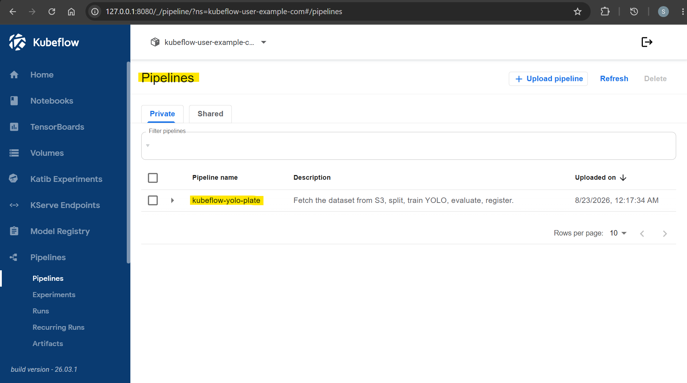
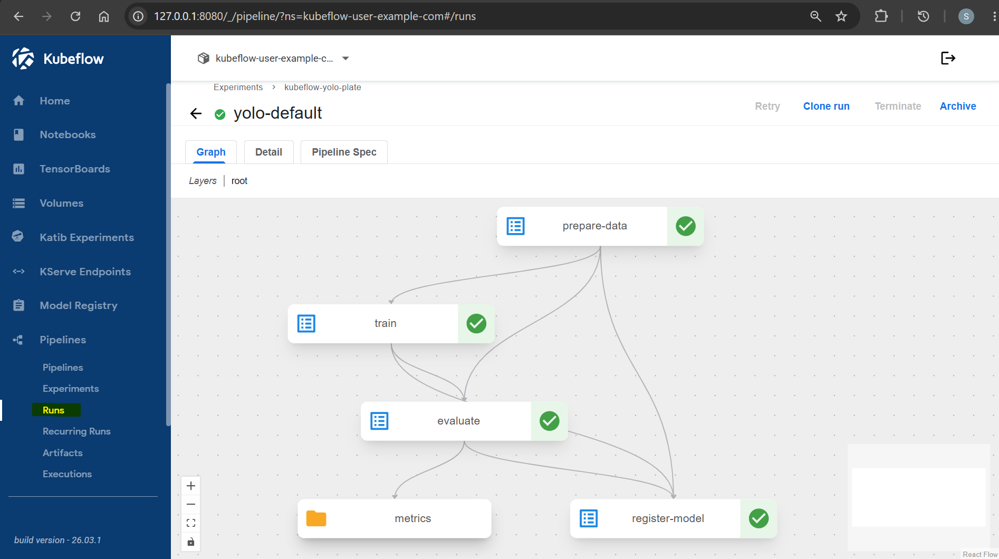
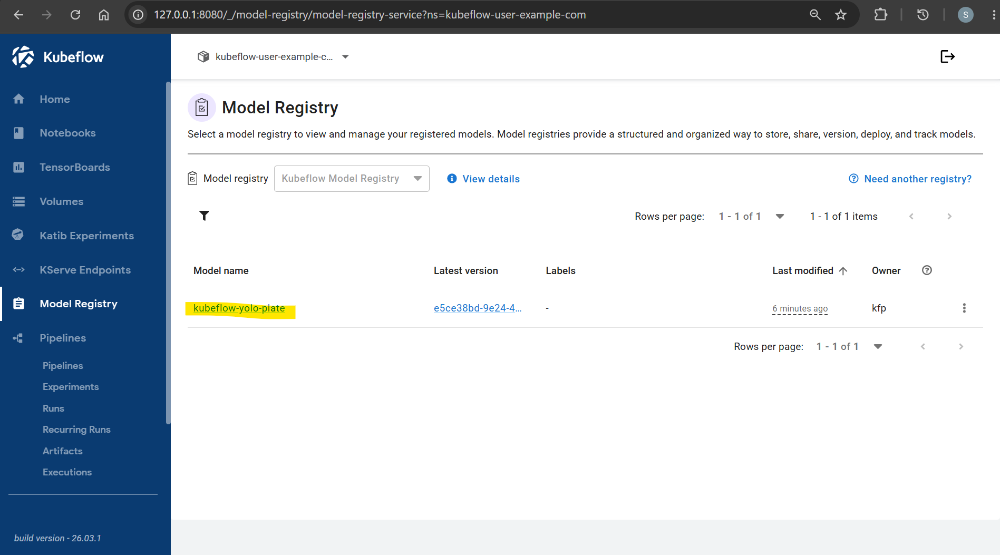

# Kubeflow: Pipeline

[Back](../README.md)

- [Kubeflow: Pipeline](#kubeflow-pipeline)
  - [Pipeline Design](#pipeline-design)
    - [Output layout](#output-layout)
  - [Pipeline](#pipeline)
    - [Arguments](#arguments)

---

## Pipeline Design

```txt
prepare_data -> train -> evaluate -> register_model
```

| Step             | Does                                                                                    |
| ---------------- | --------------------------------------------------------------------------------------- |
| `prepare_data`   | Reads the DVC-tracked dataset from S3, splits train/val server-side, writes `data.yaml` |
| `train`          | Fine-tunes `yolo26n.pt` on a GPU node, uploads `best.pt`                                |
| `evaluate`       | Re-validates `best.pt`, logs mAP to the run's Metrics tab                               |
| `register_model` | Exports ONNX, verifies it against `best.pt`, registers in Model Registry                |

---

### Output layout

```txt
s3://<bucket>/pipeline/runs/<run-id>/
├── train/best.pt                       # trained weights
├── eval/metrics.json                   # mAP50 and the run id
└── serve/                              # registered storage_uri
    ├── model.onnx
    └── metadata.json                   # imgsz, names, opset, run_id, mAP50
```

The model registers as `kubeflow-yolo-plate`, version `<run-id>`.

---

## Pipeline

```sh
# define kpf token
kubectl apply -f kubeflow/pipelines/kfp-api-token.yaml


pip install kfp kfp-kubernetes

cd ~/kubeflow-yolo/kubeflow/pipelines/src
# compile manifest file: yolo_pipeline.yaml
python compile.py
# compiled /home/jovyan/kubeflow-yolo/kubeflow/pipelines/src/yolo_pipeline.yaml

python submit.py --epochs 50 --batch 16
# Run details: /pipeline/#/runs/details/1647e571-4cb8-414b-8340-24a72d4b82dc
# run 1647e571-4cb8-414b-8340-24a72d4b82dc
# arguments {'epochs': 50, 'batch': 16}

# submit without cache
python submit.py --no-cache

# wait until the unfinished run completed.
python submit.py --wait

# confirm
kubectl get workflows -n kubeflow-user-example-com --sort-by=.metadata.creationTimestamp
kubectl logs -n kubeflow-user-example-com <pod> -c main
```

- pipeline



- pipeline run



- register



---

### Arguments

| Argument       | Default              |
| -------------- | -------------------- |
| `epochs`       | `1`                  |
| `batch`        | `8`                  |
| `imgsz`        | `640`                |
| `split_seed`   | `0`                  |
| `dvc_dir_hash` | `0e94102a...072.dir` |

- example

```sh
python submit.py --epochs 10 --batch 16
python submit.py --dvc-dir-hash <hash>      # train against another dataset version
```
