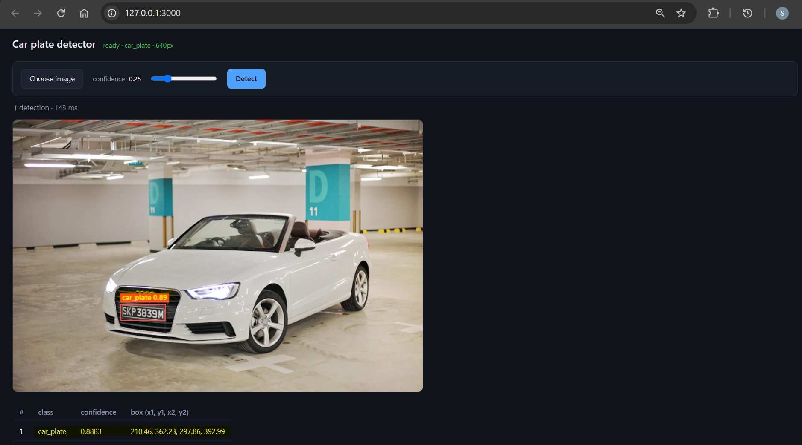
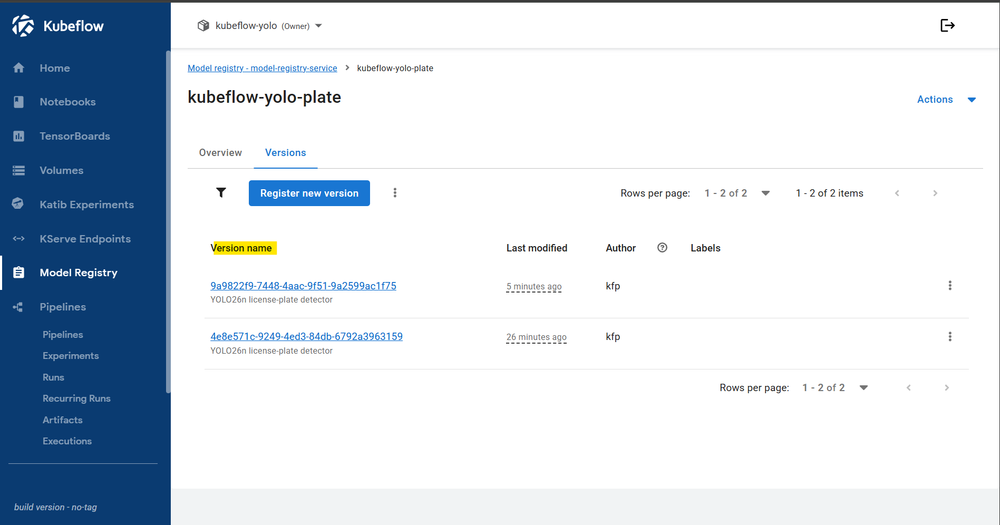
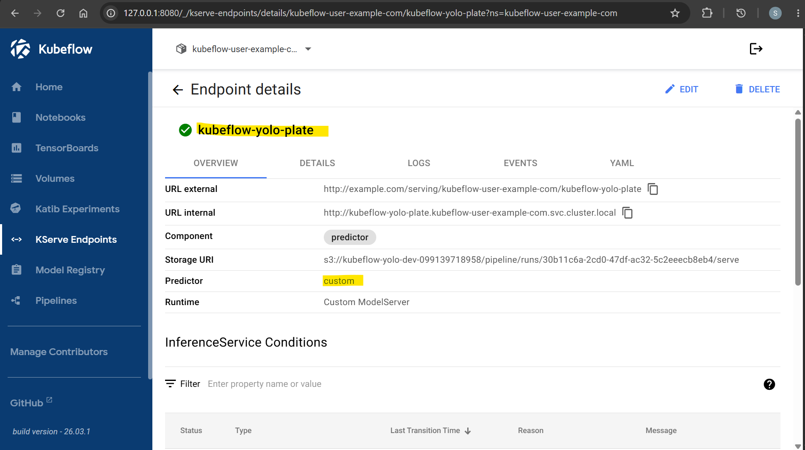

# Kubeflow: Deployment

[Back](../README.md)

- [Kubeflow: Deployment](#kubeflow-deployment)
  - [KServe](#kserve)
    - [Endpoints](#endpoints)
    - [Build and test locally](#build-and-test-locally)
    - [Push to ECR](#push-to-ecr)
    - [Deploy KServe](#deploy-kserve)

---

## KServe

```txt
s3://<bucket>/pipeline/runs/<run-id>/serve/  ->  storage-initializer  ->  /mnt/models  ->  predictor
```

---

### Endpoints

| Endpoint                         |                                                |
| -------------------------------- | ---------------------------------------------- |
| `GET /healthz`                   | liveness                                       |
| `GET /v1/models/{name}`          | readiness; 503 carries the load error          |
| `POST /v1/models/{name}:predict` | inference; per-instance `conf`/`iou` overrides |

---

### Build and test locally

`./models` bind-mounts onto `/mnt/models`, the same layout the
storage-initializer produces.

```sh
docker compose -f docker-compose.inference.yml up --build

curl localhost:8081/v1/models/kubeflow-yolo-plate
# {"name":"kubeflow-yolo-plate","ready":true,"imgsz":640,"classes":["car_plate"]}
# http://localhost:3000     UI
```

- local test



---

### Push to ECR

```sh
terraform -chdir=infra output
# ecr_repository_urls = {
#   "frontend" = "099139718958.dkr.ecr.ca-central-1.amazonaws.com/kubeflow-yolo-frontend"
#   "kserve" = "099139718958.dkr.ecr.ca-central-1.amazonaws.com/kubeflow-yolo-kserve"
# }

# login
aws ecr get-login-password --region ca-central-1 | docker login --username AWS --password-stdin 099139718958.dkr.ecr.ca-central-1.amazonaws.com

# build
docker build -f inference/Dockerfile -t kubeflow-yolo-kserve:v0.1.0-cpu .
docker tag kubeflow-yolo-kserve:v0.1.0-cpu 099139718958.dkr.ecr.ca-central-1.amazonaws.com/kubeflow-yolo-kserve:v0.1.0-cpu
# push
docker push 099139718958.dkr.ecr.ca-central-1.amazonaws.com/kubeflow-yolo-kserve:v0.1.0-cpu

# confirm
aws ecr list-images --repository-name kubeflow-yolo-kserve --region ca-central-1
```

---

### Deploy KServe

- Pick a version in registered model



```sh
# enable kserve ecr access
kubectl patch cm config-deployment -n knative-serving --type merge \
  -p '{"data":{"registries-skipping-tag-resolving":"kind.local,ko.local,dev.local,099139718958.dkr.ecr.ca-central-1.amazonaws.com"}}'

kubectl rollout restart deploy/controller -n knative-serving
# deployment.apps/controller restarted

# kubectl delete inferenceservice kubeflow-yolo-plate -n kubeflow-yolo
kubectl apply -f kubeflow/kserve/inferenceservice.yaml
# inferenceservice.serving.kserve.io/kubeflow-yolo-plate created

kubectl get inferenceservice kubeflow-yolo-plate -n kubeflow-yolo
# NAME                  URL                                                                        READY   PREV   LATEST   PREVROLLEDOUTREVISION   LATESTREADYREVISION                   AGE
# kubeflow-yolo-plate   http://example.com/serving/kubeflow-yolo/kubeflow-yolo-plate   True           100                              kubeflow-yolo-plate-predictor-00001   37s

# confirm
kubectl get svc -n kubeflow-yolo
# NAME                                          TYPE           CLUSTER-IP       EXTERNAL-IP                                            PORT(S)                                     AGE
# kubeflow-yolo-plate                           ExternalName   <none>           knative-local-gateway.istio-system.svc.cluster.local   <none>                                      27m
# kubeflow-yolo-plate-predictor                 ExternalName   <none>           knative-local-gateway.istio-system.svc.cluster.local   80/TCP                                      27m
# kubeflow-yolo-plate-predictor-00001           ClusterIP      172.20.230.208   <none>                                                 80/TCP,443/TCP                              27m

# test svc
kubectl port-forward -n kubeflow-yolo   deploy/kubeflow-yolo-plate-predictor-00001-deployment 8082:8080

# test model load
curl localhost:8082/v1/models/kubeflow-yolo-plate
# {"name":"kubeflow-yolo-plate","ready":true,"imgsz":640,"classes":["car_plate"]}
```

- KServe endpoint



---
