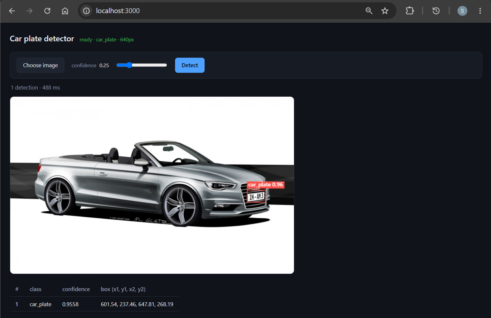

# Kubeflow: Frontend Deployment

[Back](../README.md)

- [Kubeflow: Frontend Deployment](#kubeflow-frontend-deployment)
  - [Frontend](#frontend)
    - [Build app image and push](#build-app-image-and-push)
    - [Deploy app](#deploy-app)

---

## Frontend

### Build app image and push

```sh
terraform -chdir=infra/project output
# ecr_repository_urls = {
#   "frontend" = "099139718958.dkr.ecr.ca-central-1.amazonaws.com/kubeflow-yolo-frontend"
#   "kserve" = "099139718958.dkr.ecr.ca-central-1.amazonaws.com/kubeflow-yolo-kserve"
# }

# build
docker build -f frontend/Dockerfile -t 099139718958.dkr.ecr.ca-central-1.amazonaws.com/kubeflow-yolo-frontend:v0.1.0 .
# push
docker push 099139718958.dkr.ecr.ca-central-1.amazonaws.com/kubeflow-yolo-frontend:v0.1.0
# restart
kubectl rollout restart deploy/kubeflow-yolo-ui -n kubeflow-yolo
# deployment.apps/kubeflow-yolo-ui restarted

# confirm
aws ecr list-images --repository-name kubeflow-yolo-frontend --region ca-central-1
```

---

### Deploy app

```sh
# deploy frontend
kubectl apply -f frontend/k8s/deployment.yaml
# deployment.apps/kubeflow-yolo-ui created
# service/kubeflow-yolo-ui created

# confirm
kubectl get po -n kubeflow-yolo -l app=kubeflow-yolo-ui
# NAME                               READY   STATUS    RESTARTS   AGE
# kubeflow-yolo-ui-b6f64d8f5-457cb   2/2     Running   0          2m2s

kubectl get service/kubeflow-yolo-ui -n kubeflow-yoloom
# NAME               TYPE        CLUSTER-IP      EXTERNAL-IP   PORT(S)   AGE
# kubeflow-yolo-ui   ClusterIP   172.20.60.224   <none>        80/TCP    41s

# test
kubectl port-forward -n kubeflow-yolo svc/kubeflow-yolo-ui 3000:80
# http://localhost:3000

# test dns
curl https://kubeflow.arguswatcher.net/
```


