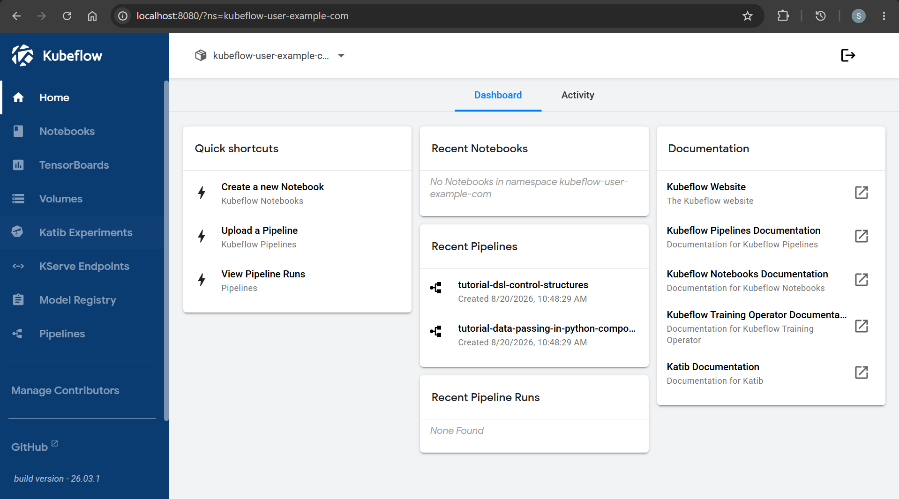

- wsl

```sh
# eks init
terraform -chdir=infra fmt && terraform -chdir=infra validate
terraform -chdir=infra apply -auto-approve

# kubeconfig update
aws eks update-kubeconfig --region ca-central-1 --name kubeflow-yolo-dev

# storageclass
k get storageclass
# NAME            PROVISIONER             RECLAIMPOLICY   VOLUMEBINDINGMODE      ALLOWVOLUMEEXPANSION   AGE
# gp2             kubernetes.io/aws-ebs   Delete          WaitForFirstConsumer   false                  61m
# gp3 (default)   ebs.csi.aws.com         Delete          WaitForFirstConsumer   true                   54m
# gp3-iops        ebs.csi.aws.com         Retain          WaitForFirstConsumer   true                   43m

# clone
git clone https://github.com/kubeflow/community-distribution.git
# checkout latest release branch

cd community-distribution
git checkout release-26.03.1

# install
while ! kustomize build example | kubectl apply --server-side --force-conflicts -f -; do echo "Retrying to apply resources"; sleep 20; done

# confirm
kubectl get pods -n cert-manager
# NAME                                       READY   STATUS              RESTARTS   AGE
# cert-manager-74bfd9fd8b-8dz9n              0/1     ContainerCreating   0          7m32s
# cert-manager-cainjector-5c89fd994b-z52mh   1/1     Running             0          53m
# cert-manager-cainjector-7fcd95ddb9-8qzpj   0/1     ContainerCreating   0          7m32s
# cert-manager-f648fc988-k6hpx               1/1     Running             0          53m
# cert-manager-webhook-75bb6df98b-5lsmg      1/1     Running             0          53m
# cert-manager-webhook-7b6856df8d-6cfdj      0/1     ContainerCreating   0          7m32s


kubectl get pods -n istio-systemem
# NAME                                     READY   STATUS    RESTARTS   AGE
# cluster-local-gateway-869bffccbb-69w8t   1/1     Running   0          5m35s
# istio-cni-node-5l8tn                     1/1     Running   0          50m
# istio-cni-node-dxc2f                     1/1     Running   0          50m
# istio-cni-node-sf4fx                     1/1     Running   0          50m
# istio-ingressgateway-79449c5b89-45pw8    1/1     Running   0          5m35s
# istiod-6744f496cd-7c75m                  1/1     Running   0          5m35s
# ztunnel-5xd7f                            1/1     Running   0          50m
# ztunnel-dkpv5                            1/1     Running   0          50m
# ztunnel-vbhdh                            1/1     Running   0          50m

kubectl get pods -n auth
# NAME                   READY   STATUS    RESTARTS   AGE
# dex-6b44d9d8d8-b8l67   1/1     Running   0          5m53s
# dex-6b44d9d8d8-jvh4l   1/1     Running   0          5m53s

kubectl get pods -n oauth2-proxy
# NAME                           READY   STATUS    RESTARTS   AGE
# oauth2-proxy-c77dcb7f8-8szsh   1/1     Running   0          5m59s
# oauth2-proxy-c77dcb7f8-w2nkz   1/1     Running   0          5m59s

kubectl get pods -n knative-serving
# NAME                                    READY   STATUS    RESTARTS   AGE
# activator-664bfc9bdd-xzl4v              2/2     Running   0          6m29s
# autoscaler-55647d5956-8wd69             2/2     Running   0          6m29s
# controller-58467d45bb-gbpps             2/2     Running   0          6m29s
# net-istio-controller-55794746c9-h9bvw   2/2     Running   0          6m29s
# net-istio-webhook-848d4b7d5f-tz2h7      2/2     Running   0          6m29s
# webhook-679db87d6d-cdt8r                2/2     Running   0          6m29s

kubectl get pods -n kubeflow
# NAME                                                    READY   STATUS    RESTARTS        AGE
# cache-server-cc85b6cc4-cz9k8                            2/2     Running   0               6m46s
# dashboard-7f56dddfc8-j7vg6                              2/2     Running   0               6m46s
# jupyter-web-app-deployment-b8477594d-cdjgn              2/2     Running   0               6m46s
# katib-controller-788f5d4d74-c7sg9                       1/1     Running   0               6m46s
# katib-db-manager-5ff5b5584b-tfh4p                       1/1     Running   1 (4m14s ago)   6m45s
# katib-mysql-9bf558555-qfqls                             1/1     Running   0               6m45s
# katib-ui-6b867d986d-5fjsb                               2/2     Running   0               6m45s
# kserve-controller-manager-5fb7465ffc-xxm96              2/2     Running   0               6m45s
# kserve-localmodel-controller-manager-75d4b5d49f-mqvjl   2/2     Running   0               6m45s
# kserve-models-web-application-69cb88b55b-5l6pm          2/2     Running   0               6m44s
# kubeflow-pipelines-profile-controller-85775988f-c9dn6   1/1     Running   0               6m44s
# llmisvc-controller-manager-dd76c8dc7-z5jps              2/2     Running   0               6m43s
# metacontroller-0                                        1/1     Running   0               6m46s
# metadata-envoy-deployment-bb49454b5-xlc6b               1/1     Running   0               6m44s
# metadata-grpc-deployment-84c6f9cf79-mlbkr               2/2     Running   5 (2m30s ago)   6m43s
# metadata-writer-5fb5cff9bd-65s5r                        2/2     Running   0               6m42s
# ml-pipeline-6848b5d4d7-4xk86                            2/2     Running   0               6m42s
# ml-pipeline-persistenceagent-646f88694b-f4lhq           2/2     Running   0               6m42s
# ml-pipeline-scheduledworkflow-f4994d98-fr6wk            2/2     Running   0               6m42s
# ml-pipeline-ui-6f6789c496-t7zxg                         2/2     Running   0               6m42s
# ml-pipeline-viewer-crd-74d9fbf5cd-j6hq5                 2/2     Running   0               6m41s
# ml-pipeline-visualizationserver-787f4cb9f7-bkc6h        2/2     Running   0               6m41s
# model-catalog-postgres-0                                1/1     Running   0               6m46s
# model-catalog-server-5cc8cc7786-g5pfk                   2/2     Running   0               6m40s
# mysql-5b6cf8556-fhmq7                                   2/2     Running   0               6m40s
# notebook-controller-deployment-5dbb765757-4rfw6         2/2     Running   0               6m40s
# poddefaults-webhook-deployment-76569d97d5-k69j2         1/1     Running   0               6m40s
# profiles-deployment-7d78b69f85-c89g6                    3/3     Running   0               6m39s
# pvcviewer-controller-manager-84cf5bcf86-d4s7w           3/3     Running   0               6m39s
# seaweedfs-5f6996f6f-ptskf                               2/2     Running   0               6m39s
# spark-operator-controller-55657d7f89-lrcbw              1/1     Running   0               6m39s
# spark-operator-webhook-769497d65d-nkp46                 1/1     Running   0               6m39s
# tensorboard-controller-deployment-5ff96f87cb-vtkqm      3/3     Running   0               6m38s
# tensorboards-web-app-deployment-d5dcf7785-lfx84         2/2     Running   0               6m38s
# volumes-web-app-deployment-84d6cb98c-9gbh5              2/2     Running   0               6m38s
# workflow-controller-cd549fb55-xpfzq                     2/2     Running   0               6m38s

kubectl get pods -n kubeflow-user-example-com
# NAME                                         READY   STATUS    RESTARTS   AGE
# model-registry-db-86979795c4-v8lwg           1/1     Running   0          3m18s
# model-registry-deployment-64686c8cbf-prxmd   2/2     Running   0          3m18s
# model-registry-ui-6cc794669b-7g2vl           2/2     Running   0          3m18s

# login ui
kubectl port-forward svc/istio-ingressgateway -n istio-system 8080:80
# ad: http://127.0.0.1:8080/
# default email: user@example.com
# default password: 12341234

```

- dashboard



- notebook

---

## Notebook

```sh
kubectl apply -f kubeflow/notebook/
notebook.kubeflow.org/yolo-cpu applied
persistentvolumeclaim/yolo-cpu-workspace applied

kubectl get notebook,pod,pvc -n kubeflow-user-example-com
# NAME                             AGE
# notebook.kubeflow.org/yolo-cpu   3m5s

# NAME                                             READY   STATUS    RESTARTS   AGE
# pod/model-registry-db-86979795c4-v8lwg           1/1     Running   0          58m
# pod/model-registry-deployment-64686c8cbf-prxmd   2/2     Running   0          58m
# pod/model-registry-ui-6cc794669b-7g2vl           2/2     Running   0          58m
# pod/yolo-cpu-0                                   2/2     Running   0          3m5s

# NAME                                       STATUS   VOLUME                                     CAPACITY   ACCESS MODES   STORAGECLASS   VOLUMEATTRIBUTESCLASS   AGE
# persistentvolumeclaim/metadata-postgres    Bound    pvc-33bae81a-ed79-4a69-b011-513b3550da79   10Gi       RWO            gp3            <unset>                 59m
# persistentvolumeclaim/yolo-cpu-workspace   Bound    pvc-684c9663-4b37-4133-972c-2c5b8c6d1dc7   20Gi       RWO            gp3            <unset>                 3m5s

kubectl get pod yolo-cpu-0 -n kubeflow-user-example-com -o wide
# NAME         READY   STATUS    RESTARTS   AGE     IP           NODE                                          NOMINATED NODE   READINESS GATES
# yolo-cpu-0   2/2     Running   0          3m36s   10.0.12.20   ip-10-0-12-37.ca-central-1.compute.internal   <none>           <none>


```

---

## Train model

### Track data

```sh
# install dvc in venv
pip install -r requirements.txt

dvc version
# DVC version: 3.67.1 (pip)

# Initialize 
dvc init
# Initialized DVC repository.

# You can now commit the changes to git.

# +---------------------------------------------------------------------+
# |                                                                     |
# |        DVC has enabled anonymous aggregate usage analytics.         |
# |     Read the analytics documentation (and how to opt-out) here:     |
# |             <https://dvc.org/doc/user-guide/analytics>              |
# |                                                                     |
# +---------------------------------------------------------------------+

# What's next?
# ------------
# - Check out the documentation: <https://dvc.org/doc>
# - Get help and share ideas: <https://dvc.org/chat>
# - Star us on GitHub: <https://github.com/treeverse/dvc>

# get bucket id
terraform -chdir=infra output -raw s3_bucket_name
# kubeflow-yolo-dev-099139718958

# Set S3 as Remote Storage
dvc remote add -d s3 s3://kubeflow-yolo-dev-099139718958/data/raw
# Setting 's3' as a default remote.

# track data
dvc add data/raw
# 100% Adding...|███████████████████████████████████████████████████████████████████████████████████████████|1/1 [00:00,  2.37file/s]
                                                                                                                                   
# To track the changes with git, run:

#         git add 'data\raw.dvc'

# To enable auto staging, run:

#         dvc config core.autostage true

git add .gitignore data/raw.dvc .dvc/config
git commit -m "dvc: track data/raw"
dvc push
# Collecting                                                                                                   |1.11k [00:01,  985entry/s]
# Pushing
# 1096 files pushed                                                                                                  

```

---

# training

# katib

# pipeline

```

```
