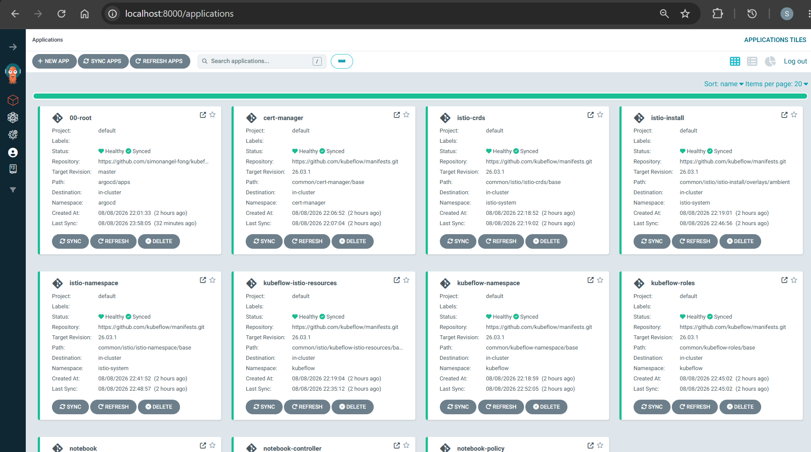
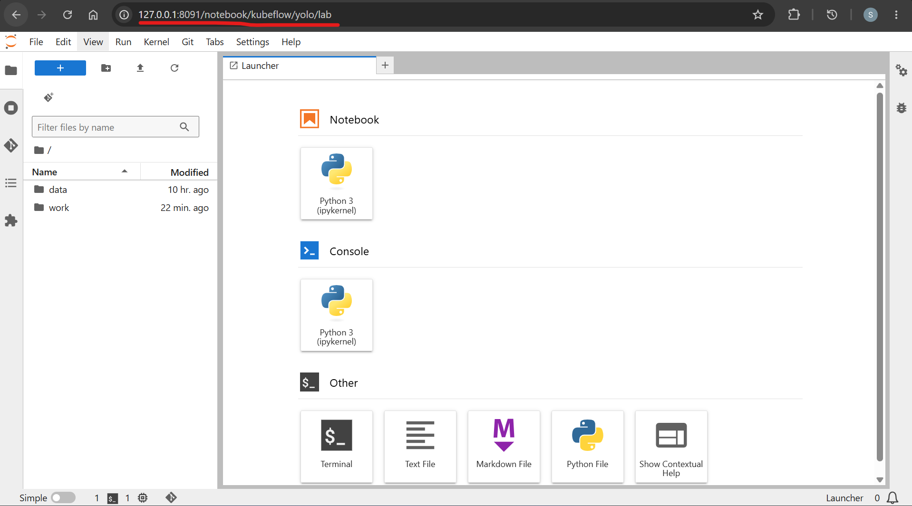

# Kubeflow YOLO - Local Cluster(kind)

[Back](../README.md)

- [Kubeflow YOLO - Local Cluster(kind)](#kubeflow-yolo---local-clusterkind)
  - [Create cluster](#create-cluster)
  - [Prerequisites](#prerequisites)
  - [Install ArgoCD](#install-argocd)
  - [ArgoCD root](#argocd-root)
  - [Notebook](#notebook)
  - [Trainer v2](#trainer-v2)

---

## Create cluster

```sh
kind create cluster --config kind/cluster.yaml
# Creating cluster "desktop" ...
#  • Ensuring node image (kindest/node:v1.35.0) 🖼  ...
#  ✓ Ensuring node image (kindest/node:v1.35.0) 🖼
#  • Preparing nodes 📦   ...
#  ✓ Preparing nodes 📦
#  • Writing configuration 📜  ...
#  ✓ Writing configuration 📜
#  • Starting control-plane 🕹️  ...
#  ✓ Starting control-plane 🕹️
#  • Installing CNI 🔌  ...
#  ✓ Installing CNI 🔌
#  • Installing StorageClass 💾  ...
#  ✓ Installing StorageClass 💾
# Set kubectl context to "kind-desktop"
# You can now use your cluster with:
# kubectl cluster-info --context kind-desktop

kubectl cluster-info --context kind-desktop
# Kubernetes control plane is running at https://127.0.0.1:9981
# CoreDNS is running at https://127.0.0.1:9981/api/v1/namespaces/kube-system/services/kube-dns:dns/proxy

# To further debug and diagnose cluster problems, use 'kubectl cluster-info dump'.


# Have a nice day! 👋

# confirm cluster
kubectl get node
# NAME                    STATUS   ROLES           AGE     VERSION
# desktop-control-plane   Ready    control-plane   2m27s   v1.35.0
```

- Test mountable

```sh
# ##############################
# Confirm mountable
# ##############################
kubectl apply -f kind/mount-check.yaml
# pod/mount-check created

kubectl logs mount-check
# total 200960
# drwxrwxrwx    1 root     root           512 Aug  8 02:05 .
# drwxrwxrwx    1 root     root           512 Aug  8 18:21 ..
# -rwxrwxrwx    1 root     root         76060 Aug  7 16:27 audi_a3_convertible_with_license_plate_11.jpeg
# -rwxrwxrwx    1 root     root            76 Aug  7 16:27 audi_a3_convertible_with_license_plate_11.txt

kubectl delete -f kind/mount-check.yaml
# pod "mount-check" deleted from default namespace

```

---

## Prerequisites

- metrics server

```sh
helm repo add metrics-server https://kubernetes-sigs.github.io/metrics-server/
helm repo update metrics-server
helm search repo metrics-server/metrics-server
# NAME                            CHART VERSION   APP VERSION     DESCRIPTION
# metrics-server/metrics-server   3.13.1          0.8.1           Metrics Server is a scalable, efficient source .

helm install metrics-server metrics-server/metrics-server --version 3.13.1 --namespace kube-system -f kind/metrics-server-values.yaml --wait --timeout 5m

# confirm
kubectl top nodes
# NAME                    CPU(cores)   CPU(%)   MEMORY(bytes)   MEMORY(%)
# desktop-control-plane   153m         1%       2148Mi          27%

kubectl -n istio-system get hpa
# NAME                   REFERENCE                         TARGETS       MINPODS   MAXPODS   REPLICAS   AGE
# istio-ingressgateway   Deployment/istio-ingressgateway   cpu: 4%/80%   1         5         1          11m
# istiod                 Deployment/istiod                 cpu: 0%/80%   1         5         1          11m
```

---

## Install ArgoCD

```sh
helm repo add argo https://argoproj.github.io/argo-helm
helm repo update argo

helm search repo argo/argo-cd
# NAME            CHART VERSION   APP VERSION     DESCRIPTION
# argo/argo-cd    10.1.4          v3.4.5          A Helm chart for Argo CD, a declarative, GitOps...

helm install argocd argo/argo-cd --version 10.3.0 --namespace argocd --create-namespace -f kind/argocd-values.yaml --wait --timeout 10m

# confirm
kubectl get pods -n argocd
# NAME                                                READY   STATUS    RESTARTS   AGE
# argocd-application-controller-0                     1/1     Running   0          12m
# argocd-applicationset-controller-76cf4f7f59-cf2t5   1/1     Running   0          12m
# argocd-redis-6744cf7696-rntxf                       1/1     Running   0          12m
# argocd-repo-server-66b9bbbc5b-2mk9v                 1/1     Running   0          12m
# argocd-server-55bb599c74-ptl8k                      1/1     Running   0          12m

# access
kubectl port-forward -n argocd svc/argocd-server 8000:80
# Forwarding from 127.0.0.1:8000 -> 8080
# Forwarding from [::1]:8000 -> 8080

# initial admin password
kubectl -n argocd get secret argocd-initial-admin-secret -o jsonpath="{.data.password}" | base64 -d

# argocd login 127.0.0.1:8000 --username admin --insecure --plaintext
# argocd cluster list
# argocd app list
```

UI at http://127.0.0.1:8081.

---

## ArgoCD root

```sh
# ##############################
# app of apps
# ##############################
kubectl apply -f argocd/root.yaml
# application.argoproj.io/00-root created
```



---

## Notebook

```sh
# ##############################
# notebook controller
# ##############################
kubectl get crd notebooks.kubeflow.org
# NAME                     CREATED AT
# notebooks.kubeflow.org   2026-08-09T02:54:33Z

kubectl -n kubeflow get pods -l app=notebook-controller
# NAME                                              READY   STATUS    RESTARTS   AGE
# notebook-controller-deployment-6c8dc45c48-t8gb4   1/1     Running   0          112s

kubectl -n kubeflow get pvc
# NAME             STATUS   VOLUME                                     CAPACITY   ACCESS MODES   STORAGECLASS   VOLUMEATTRIBUTESCLASS   AGE
# yolo-data        Bound    yolo-data                                  20Gi       ROX            host-data      <unset>                 12m
# yolo-workspace   Bound    pvc-0ce1a9b1-9b71-4402-8531-4ab947bcde6b   5Gi        RWO            standard       <unset>                 9m44s

kubectl -n kubeflow get pod -l notebook-name=yolo
# NAME     READY   STATUS    RESTARTS   AGE
# yolo-0   1/1     Running   0          72m

kubectl -n kubeflow get notebook
# NAME   AGE
# yolo   6m16s

kubectl -n kubeflow get svc

kubectl -n istio-system port-forward svc/istio-ingressgateway 8091:80

# http://127.0.0.1:8091/notebook/kubeflow/yolo/
```



---

## Trainer v2

```sh
# ##############################
# trainer v2
# ##############################
kubectl get crd | grep -E "trainer.kubeflow.org|jobset"
# clustertrainingruntimes.trainer.kubeflow.org   2026-08-09T05:00:26Z
# jobsets.jobset.x-k8s.io                        2026-08-09T05:00:26Z
# trainingruntimes.trainer.kubeflow.org          2026-08-09T05:00:26Z
# trainjobs.trainer.kubeflow.org                 2026-08-09T05:00:26Z

kubectl -n kubeflow get pods | grep -E "trainer|jobset"
# jobset-controller-manager-77785775b9-8wkjc             1/1   Running   0   53s
# kubeflow-trainer-controller-manager-5dcc6c885f-p75ph   1/1   Running   0   53s

kubectl get clustertrainingruntime
# NAME                     AGE
# deepspeed-distributed    52s
# jax-distributed          52s
# mlx-distributed          52s
# torch-distributed        52s
# torchtune-llama3.2-1b    52s
# torchtune-llama3.2-3b    52s
# torchtune-qwen2.5-1.5b   52s
# xgboost-distributed      51s

# the notebook's identity can submit
kubectl auth can-i create trainjobs.trainer.kubeflow.org --as=system:serviceaccount:kubeflow:default-editor -n kubeflow
# yes
```

- Train

```sh
kubectl -n kubeflow get trainjob
kubectl -n kubeflow get jobset

kubectl -n kubeflow delete trainjob job_id
```
