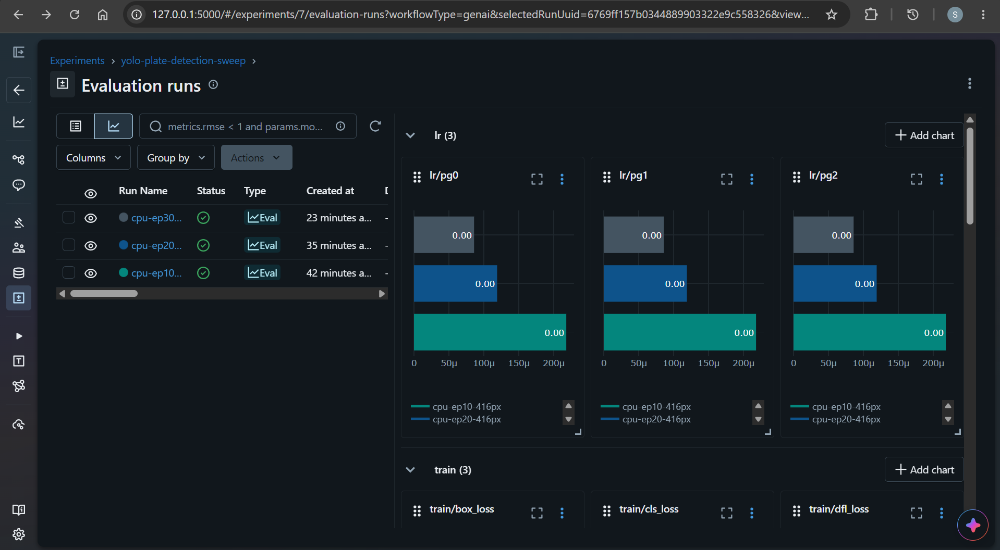
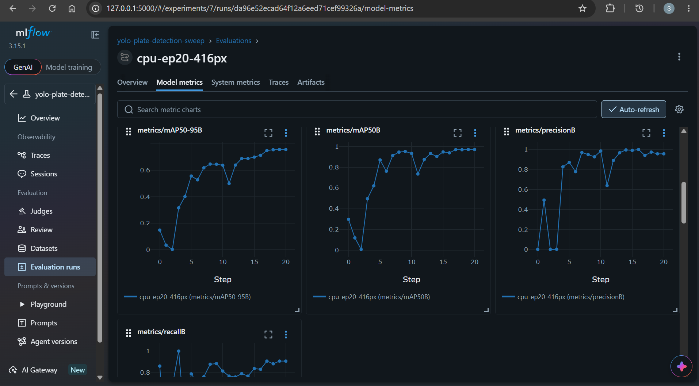

# Local Train

[Back](../README.md)

- [Local Train](#local-train)
  - [Local venv](#local-venv)
    - [Setup venv](#setup-venv)
    - [Configure model](#configure-model)
  - [Tracking with MLflow](#tracking-with-mlflow)

---

## Local venv

Stack

- python 3.12, venv
- docker compose
  - jupyter notebook
  - mlflow

### Setup venv

Create the environment and install:

```sh
py -3.12 -m venv .venv

pip install --upgrade pip
pip install -r requirements.venv.txt
```

---

### Configure model

**`configs/data.yaml`**: data config file
**`configs/train.yaml`**: train config file

**Model**:

- `yolo11n.pt`: the smallest variant, pretrained.

---

## Tracking with MLflow

```sh
docker compose -f docker-compose.yml up -d --build

docker compose -f docker-compose.yml down -v
```




